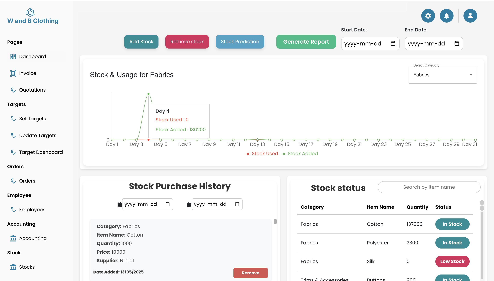
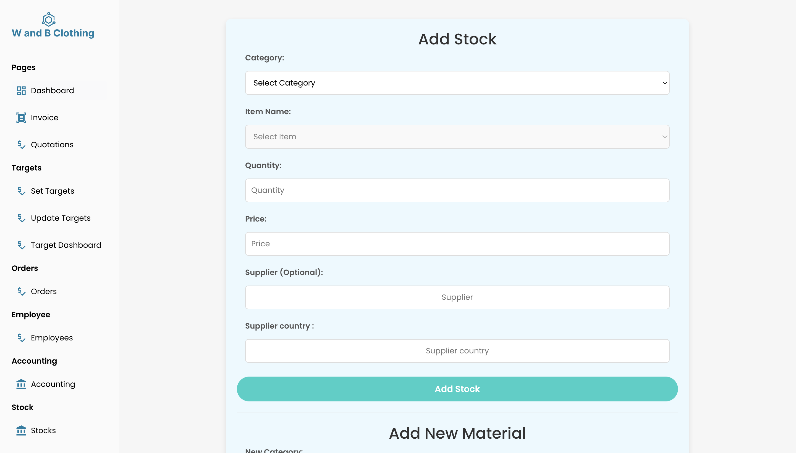

Garment Stock Management System 

This is the Stock Management Module of the Garment Management System. It is designed to simplify inventory operations for medium-scale garment businesses by allowing users to efficiently add, track, retrieve, and analyze stock.

Features

* Add Stock

    * Add garments, fabrics, and accessories with details (item name, category, quantity, price, supplier, supplier country).

* Retrieve Stock

    * Record stock usage or sales.

* Real-Time Updates

    * MongoDB backend ensures all stock data stays synchronized.

* Stock Prediction (AI-powered)

    * Uses Gemini API to analyze last year’s stock data and predict required stock and costs for a given date range.

* Reports

    * Stock & retrieval data for a selected time range.
    * Movement summary (fast/slow-moving items).
    * Negative stock detection 
    * Insights & demand trends.

* Android App Support     

    *  link for android app : https://github.com/Ishanlahiru61/smart-stock-manager.git
    * Mobile interface for adding/retrieving stock with a confirmation popup.
    * OCR-based input (future feature). 

Tech Stack
                 
           Frontend: React.js (web)
           Backend: Node.js + Express.js
           Database: MongoDB
           AI/Prediction: Gemini 2.5 Pro API          
           Other: Retrofit (for Android API calls)

  # Garment Stock Management System  

This project manages garment stock operations efficiently.  

##  Screenshots  

### 1. Dashboard  
  

### 2. Stock Add Form  
  

### 3. Stock Retrieve Form 

